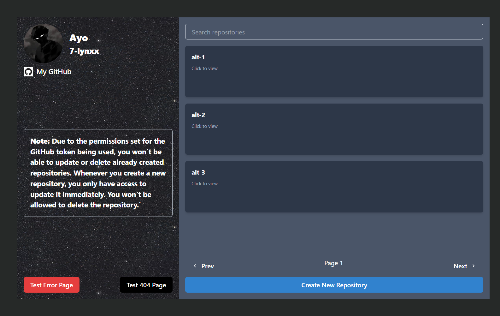

# Github Portfolio

## Overview
A web application to display all of my repositories on a web page with pagination logic implemented.
Modals are included to create new repostiories and update the newly created repo.

## Project Screenshot

## Installation and Setup instructions

 You will need node and npm installed globally on your machine.

 ### Installation

 `npm install`

 ### To start server 

 `npm run dev`

 ### To visit app 

 [Go to App](https://github-portfolio-1.vercel.app/)

 ##Reflection

 This was a week long project built for my second semester Altschool examination. The goals of the project included implementing technologies learned up until this point and familiarizing myself with documentation for new features.

 Originally, I wanted to build the app to fetch the repos and then handle the pagination using another component, but reading documentation about the axios get method and how to use it with the github parameters, I was able to handle the pagination using the perpage paramter.

 One of the main challenges I ran into was trying to prevent unnecessary re-renders in my component. I solved this using the useCallback method which was also one of the things I enjoyed learning aboout besides designing layout using the Chakra UI library.

 At the end of the day, the technologies implemented in this project are React, Chakra UI, Tailwind CSS, React Router, and Helmet. I chose to use the `create vite@latest "" -- --template react` boilerplate to minimize initial setup.
